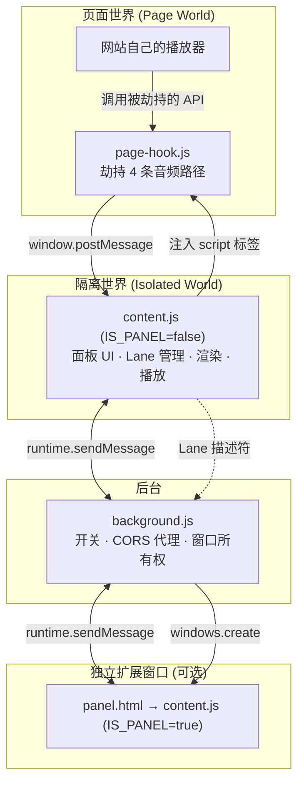
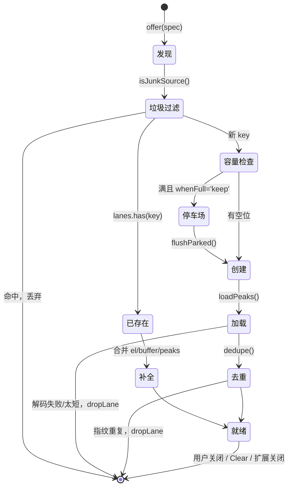

# Waveform Viewer — 设计文档

> 版本 1.4.2 · 对应源码 `src/content.js` (1978 行) / `src/page-hook.js` (235 行) / `src/background.js` (250 行)
> 仓库 <https://github.com/EricZhou866/waveform-viewer> · MIT

---

## 目录

1. [目标与非目标](#1-目标与非目标)
2. [总体架构](#2-总体架构)
3. [运行上下文与文件职责](#3-运行上下文与文件职责)
4. [音频发现](#4-音频发现)
5. [跨世界通信协议](#5-跨世界通信协议)
6. [Lane 生命周期](#6-lane-生命周期)
7. [去重：波形指纹](#7-去重波形指纹)
8. [时间轴模型](#8-时间轴模型)
9. [静音裁剪算法](#9-静音裁剪算法)
10. [播放引擎](#10-播放引擎)
11. [渲染管线](#11-渲染管线)
12. [交互设计](#12-交互设计)
13. [独立窗口与 Lane 移交](#13-独立窗口与-lane-移交)
14. [下载与 WAV 编码](#14-下载与-wav-编码)
15. [跨浏览器差异](#15-跨浏览器差异)
16. [权限与隐私](#16-权限与隐私)
17. [持久化 Schema](#17-持久化-schema)
18. [关键设计约束与取舍](#18-关键设计约束与取舍)
19. [踩坑档案](#19-踩坑档案)
20. [测试策略](#20-测试策略)
21. [构建与发布](#21-构建与发布)
22. [未来方向](#22-未来方向)

---

## 1. 目标与非目标

### 起因

PTE / 雅思一类口语练习的核心动作是**把范读和自己的录音放在一起比**。这件事光靠耳朵不够——听不出"我的停顿多了 180ms"、"我的重音落在第二个音节而不是第一个"。看波形能一眼看出来，但现有流程是：下载音频 → 打开 Audacity → 导入两条 → 手工对齐。太重，练一题不值得开一次桌面编辑器。

Waveform Viewer 把这套动作压到浏览器里：网页放什么，面板上就出现什么波形。

### 目标

| # | 目标 | 判定标准 |
|---|------|---------|
| G1 | 任何网页播放的音频都能画出波形 | 包括不创建 `<audio>` 元素、纯 Web Audio 的播放器 |
| G2 | 多条波形可叠放对比 | 共享时间轴，纵向对齐 |
| G3 | 对齐是一键的 | 不需要手工找起点 |
| G4 | 停顿时长可读数 | 毫秒级 |
| G5 | 可以搬到副屏 | 波形铺满屏幕而不是缩在角落 |
| G6 | 纯本地 | 不联网、不上报、无账号 |
| G7 | 双浏览器 | Chrome MV3 + Firefox MV2，同一份 `src/` |

### 非目标

- **不做音频编辑器**。不裁剪保存回原文件、不做淡入淡出、不做多轨混音。
- **不做声学分析**。不画频谱图、不标 F0 曲线、不算共振峰。这些留给专门工具；本扩展只解决"看波形"这一件事。
- **不做录音**。不申请麦克风权限。
- **不做云端**。没有服务器就没有隐私政策争议，也不需要用户注册。

---

## 2. 总体架构

三个隔离的 JS 世界 + 一个可选的独立窗口。



**为什么必须有三层？**

- `page-hook.js` 在页面世界，因为只有在那里才能替换掉页面即将调用的 `AudioContext.prototype.decodeAudioData`。内容脚本在隔离世界，改不到页面的原型链。
- `content.js` 在隔离世界，因为它需要 `chrome.*` API（storage、runtime、tabs 消息），而页面世界拿不到这些。
- `background.js` 存在的唯一硬理由是**它不受页面 CORS 限制**。音频常常从没有 CORS 头的 CDN 来，内容脚本 `fetch` 会被拦，后台不会。

---

## 3. 运行上下文与文件职责

### 3.1 `content.js` 的双重身份

同一个文件在两种环境下跑，靠协议判定：

```js
const IS_PANEL = /-extension:$/.test(location.protocol);
```

匹配 `chrome-extension:` 和 `moz-extension:`，同时兼容两个引擎。

| | 内容脚本模式 (`IS_PANEL=false`) | 面板窗口模式 (`IS_PANEL=true`) |
|---|---|---|
| 宿主 | 任意网页 | `panel.html` |
| 面板容器 | `position:fixed` 浮层 + Shadow DOM | 铺满整个窗口 |
| 音频来源 | 页面发现 + 本地文件 | Lane 移交 + 本地文件 |
| 有 `Rescan` / `Window` / 折叠按钮 | 是 | 否（`ensurePanel()` 里移除） |
| Lane 高度 | 用户按 `＋/－` 调 | `fitPanelWindow()` 按窗口高度自动均分 |
| 空格键 | 需要 Ctrl/Cmd 修饰 | 裸空格即可 |

这个复用不是省事，是必须：面板的渲染、播放、裁剪逻辑一行都不该有两份实现，否则副屏窗口和页内面板一定会行为漂移。

### 3.2 文件清单

| 文件 | 行数 | 职责 |
|------|------|------|
| `src/content.js` | 1978 | 面板 UI、Lane 管理、时间轴、裁剪、播放、渲染、下载、设置 |
| `src/page-hook.js` | 235 | 页面世界劫持，4 条发现路径 + 1 条补扫 |
| `src/background.js` | 250 | 工具栏开关、CORS 代理、独立窗口所有权 |
| `src/panel.html` | 13 | 独立窗口的空壳，只负责加载 `content.js` |
| `manifests/*.json` | — | 三份 manifest，构建时择一 |

---

## 4. 音频发现

这是整个扩展最难的部分。**大多数波形类扩展只查 `<audio>` 元素，所以在真实的播放器上什么都看不到**——因为很多播放器（wavesurfer.js、Howler、各类在线课程平台）根本不创建媒体元素，它们 `fetch` 到 ArrayBuffer，`decodeAudioData` 解码，然后走 `AudioBufferSourceNode` 播放。DOM 里干干净净。

所以做了 5 条独立路径，任何一条挂掉不影响其他（每条都包在 `try/catch` 里）。

### 4.1 路径 1 — 媒体元素

两侧都查：

- **内容脚本侧**：`document.querySelectorAll('audio, video')` 初扫 + `MutationObserver` 监听新增 + 捕获阶段监听 `loadedmetadata` / `play` / `canplay`。
- **页面世界侧**：包装 `window.Audio` 构造器和 `HTMLMediaElement.prototype.play/load`，覆盖 `new Audio()` 这种**永远不进 DOM** 的实例。

媒体元素本身跨不过世界边界，所以 hook 只把 `currentSrc || src` 送出来。

### 4.2 路径 2 — `decodeAudioData`（最关键）

```js
Base.prototype.decodeAudioData = function (buf, ok, bad) {
  // 同时处理 callback 和 Promise 两种调用形式
}
```

包装点选在 `BaseAudioContext.prototype`（回退 `AudioContext`），因为 `OfflineAudioContext` 也继承它。

**峰值就地计算**。拿到 `AudioBuffer` 后直接在页面世界算出 2048 桶的 min/max 数组发回来，内容脚本不需要再下载一次文件。这对 `blob:` URL 尤其重要——那种 URL 从扩展页面根本 fetch 不到。

回调和 Promise 两种形式都要包：老代码用 `decodeAudioData(buf, cb)`，新代码用 `await decodeAudioData(buf)`，漏一种就少一半站点。

### 4.3 路径 3 — `fetch`

包装 `window.fetch`，在 response 上判断：

```js
function isAudioUrl(u, ct) {
  if (ct && /^(audio\/|application\/ogg)/i.test(ct)) return true;   // Content-Type 优先
  if (u.indexOf('blob:') === 0 || u.indexOf('data:audio') === 0) return true;
  return AUDIO_RE.test(new URL(u, location.href).pathname);          // 再看扩展名
}
```

`AUDIO_RE` = `/\.(mp3|wav|m4a|mp4a|aac|ogg|oga|opus|flac|weba|webm)(\?|#|$)/i`。注意是拿 `pathname` 去测，避免 query string 里带 `.mp3` 的假阳性。

### 4.4 路径 4 — `XMLHttpRequest`

包装 `open`（记下 URL）+ `send`（挂 `load` 监听）。仍有站点用 XHR 拉音频，不能只顾 `fetch`。

### 4.5 路径 5 — 补扫（Performance API）

hook 注入时页面可能已经加载过音频了。用 `performance.getEntriesByType('resource')` 回溯，再挂一个 `PerformanceObserver({ buffered: true })` 接住后续的。这条路径是纯观察，不劫持任何东西。

### 4.6 状态可见性

面板底部有一行状态：`media 2 · url 3 · decoded 1 · hook ✓`。

这不是调试残留，是**产品功能**。当一个站点用了某种没覆盖到的方式播放音频，用户看到 `hook ✓ · decoded 0` 就知道"扩展装上了、注入成功了、但这个页面的解码路径没抓到"，而不是面对一个空面板猜是不是自己装错了。

---

## 5. 跨世界通信协议

### 5.1 为什么是 `postMessage`

第一版用的是 `window.__wfBus` + Firefox 的 `wrappedJSObject` 读页面变量。**这在 Chrome 上完全跑不起来**——Chrome 的内容脚本读不到页面世界的任何变量，`wrappedJSObject` 是 Gecko 独有的。

`window.postMessage` 是唯一在两个引擎上都能用的通道。代价是所有数据必须可结构化克隆，`Float32Array` 可以（会被克隆），DOM 元素不行。

### 5.2 消息表

**页面世界 → 隔离世界**（都带 `__wf: 1` 标记）

| `kind` | 载荷 | 含义 |
|--------|------|------|
| `ready` | — | hook 安装成功，用于点亮状态行的 `hook ✓` |
| `url` | `url` | 发现一个音频 URL |
| `decoded` | `id, url, duration, mins, maxs` | 解码事件，含 2048 桶峰值 |

**隔离世界 → 页面世界**

| 标记 | 含义 |
|------|------|
| `__wfCmd: 'rescan'` | 请求把已知的最近 8 个 URL 清掉节流重新广播 |

**内容脚本 ↔ 后台**

| `type` | 方向 | 含义 |
|--------|------|------|
| `wf:getEnabled` | CS → BG | 查全局开关 |
| `wf:fetch` | CS → BG | CORS 代理下载，返回 base64 |
| `wf:openPanel` | CS → BG | 开独立窗口，带 Lane 描述符 |
| `wf:getPanelData` | Panel → BG | 面板窗口启动时索取 Lane |
| `wf:dockPanel` | Panel → BG | 关掉独立窗口，把面板交还给页面 |
| `wf:panelLane` | CS → BG | 新发现的 Lane，转发给窗口 |
| `wf:collectLanes` | BG → CS | 向标签页要当前**活的** Lane 列表 |
| `wf:enabled` | BG → CS | 广播开关变化。带 `active: true` 的那一份只发给**被点击的那个标签页**（见 §19.15） |
| `wf:panelOpen` / `wf:panelClosed` | BG → CS | 页内面板让位 / 回来 |
| `wf:panelLaneFwd` | BG → Panel | 转发一条新 Lane |

### 5.3 输入即不可信

页面世界的消息**由网页控制**，必须当作敌意输入：

```js
if (e.source !== window) return;
const d = e.data;
if (!d || d.__wf !== 1 || typeof d.kind !== 'string') return;
```

再往下每个字段都重新构造（`Float32Array.from(d.mins)`、`Number(d.duration) || 0`），不直接采用页面给的对象。这些数据唯一的去向是画一条波形，不会用于任何决策。

后台的 `sanitizeLanes()` 同理：所有描述符在进 storage 前逐字段用 `String()` / `Number()` / `!!` 重建，无法转换的整条丢弃——**且任何一条坏数据都不允许阻止窗口打开**。

---

## 6. Lane 生命周期

Lane 是核心数据结构：一条波形轨。



### 6.1 Lane 的键

| 前缀 | 场景 |
|------|------|
| `src:<url>` | URL 来源（媒体元素、fetch、XHR、hook） |
| `dec<n>` | 只有解码事件没有 URL 的 Web Audio |
| `file:<name>:<size>:<mtime>` | 本地打开的文件 |
| `bytes:<label>:<byteLength>` | 从字节移交进面板窗口的 |

### 6.2 容量与"停车场"

**默认不限条数**（`maxLanes: 0`）。每条发现的音频都生成 Lane，放不下就滚动（见 §11.5）。

v1.1.5 默认上限是 4，第 5 条起进 `parked[]` 排队。排队的本意是"绝不静默丢弃"，但实际效果是**用户看不见它们**——状态行有一行提示，可那一行既不是波形也不能点开，等于音频进了后台。上限本身才是问题：既然多出来的轨可以滚动到，就没有理由在 4 条上截断。

用户仍可以主动设一个上限（1–64），设了之后原来的两种策略照旧：

- **`keep`（默认）** — 新音频进 `parked[]` 排队，**绝不静默丢弃**。用户关掉一条或调高上限，`flushParked()` 立刻放行。
- **`replace`** — 淘汰最早的未 pin Lane；全都 pin 了就还是排队。

`PARK_MAX = 12`，超了从队头丢。

**`LANE_HARD_MAX = 64`** 是唯一的硬顶：

```js
const laneCap = () => {
  const n = Math.max(0, parseInt(cfg.maxLanes, 10) || 0);
  return n > 0 ? Math.min(n, LANE_HARD_MAX) : LANE_HARD_MAX;
};
```

每条 Lane 拿着一个解码后的 `AudioBuffer`（4 分钟立体声约 40MB），真的不封顶就是一个开着的内存泄漏。64 条对"对比几段录音"这个用途远远够用，撞上了也会在状态行里说清楚，不静默。

### 6.2.1 设置迁移

改默认值对老用户是无效的：他们的 storage 里已经存着旧值。所以有 `SETTINGS_V`（当前 3），每次改默认值就加一档：

```js
if (settings && Number(settings.v) !== SETTINGS_V) {
  const from = Number(settings.v) || 1;
  if (from < 2 && Number(settings.maxLanes) === 4) cfg.maxLanes = 0;          // v1 的 4 条上限
  if (from < 3 && Number(settings.minDur)  === 1) cfg.minDur  = DEFAULTS.minDur;  // v2 的 1 秒下限
  cfg.v = SETTINGS_V;
  saveSettings();
}
```

规则只有一条：**只迁移恰好等于旧默认值的那个数**。那是没人选过的值；有人特意设成 2 条或 8 条，就该原样保留。

### 6.3 `pin`

每条 Lane 有 ☆ 按钮。pin 过的不会被 `replace` 策略淘汰。给"范读音频固定住，自己的录音一遍遍换"这个场景用的。

### 6.4 垃圾源过滤

很多播放器在每次播放前会先播一段静音的 `data:` URI，用来解锁浏览器的音频上下文（自动播放策略）。这会造成**每次播放都冒出一条 0.00s 的空 Lane**。

三层拦截：

```js
const TINY_DATA_URI = 3000;
function isJunkSource(url) {
  if (!url) return true;
  if (rejected.has(url)) return true;                          // ③ 记住失败过的
  if (url.startsWith('data:') && url.length < TINY_DATA_URI) return true;  // ① 长度启发
  return false;
}
```

外加 ② 时长下限检查 → `rejected.add(url)` + `dropLane()`。

`rejected` 这个 Set 是必需的：没有它，同一个坏源会在每次播放时被重新 fetch + 重新解码，白烧 CPU。

### 6.5 时长下限是可配的（v1.2.0）

下限从写死的 `0.15s` 改成设置项 `minDur`，**范围 0.5–10 秒，默认 2 秒**：

```js
const MIN_DUR_LO = 0.5, MIN_DUR_HI = 10;
const minDur = () => Math.max(MIN_DUR_LO, Math.min(MIN_DUR_HI, Number(cfg.minDur) || DEFAULTS.minDur));
```

0.15s 只挡得住毫秒级的静音 primer。真正碍事的是**够长、但不是内容**的东西：UI 音效、页面切换的提示音、广告片头的一声 sting，这些常常有半秒到一秒，会挤掉用户正在对比的轨。下限该多少取决于站点，所以交给用户。

四个检查点统一走 `minDur()`：hook 的 `decoded` 事件、媒体元素的 `duration`、`addBytes()`（本地文件与字节移交）、`loadPeaks()` 解码后。

改动这个值时 `applyMinDur()` 立即生效：
- 已不合格的 Lane 直接 `dropLane()`，停车场里不合格的条目一起清掉；
- **`rejected.clear()`** —— 调低下限必须让之前被拒的源有机会回来，否则那个 Set 会把设置变成单向的。

注意：清空 `rejected` 只是解除封禁，不会自动把音频找回来——那些源从未成为 Lane，要重新播放或 `Rescan` 才会再次被发现。

---

## 7. 去重：波形指纹

### 问题

站点每次播放同一个文件都会 mint 一个**新的 `blob:` URL**。所以 URL 不能当身份。同一段音频播三次 → 三条一模一样的 Lane。

更麻烦的是：同一段音频可能**同时**从两条路径进来（hook 的 `decoded` 事件 + 内容脚本自己 fetch 解码），而这两条路径给出的峰值**分辨率不同**——hook 是 2048 桶，自己解码是 8192 桶。按数组内容做哈希必然对不上。

### 解法

指纹必须与分辨率无关：

```js
function sigOf(peaks) {
  const B = 32;                          // 固定 32 桶，与输入分辨率解耦
  // 1) 找出整段的峰值，用于归一化
  // 2) 每个桶取该区间的最大绝对幅度，除以整段峰值 → 相对响度 r
  // 3) r 量化成 4 级：<0.08 静 | <0.35 弱 | <0.7 中 | 强
  // 4) FNV-1a 滚进哈希
  return duration.toFixed(2) + ':' + hash.toString(36);
}
```

`duration` 保留 2 位小数一起进指纹，作为强判别项。

**为什么是 32 桶 4 级？** 桶数太多 → 不同分辨率的边界效应会导致失配；太少 → 不同音频撞车。4 级量化是为了容忍两条路径在归一化上的微小差异。已用单元测试验证：同一段音频在 512 / 2048 / 8192 三种分辨率下产出相同指纹。

### 合并而非简单丢弃

`dedupe()` 命中时保留先到的那条，但**把后到的那条身上有而它没有的东西搬过去**：

```js
if (!other.buffer && lane.buffer) other.buffer = lane.buffer;      // 可播放性
if (!other.raw && lane.raw) { other.raw = lane.raw; ... }          // 原始字节，用于原样下载
if (other.peaks.mins.length < lane.peaks.mins.length) { ... }      // 用更高分辨率的峰值
```

典型场景：hook 先送来 2048 桶峰值（能画，但没有 AudioBuffer，播不了），随后自己解码拿到 8192 桶 + buffer + raw。合并后这条 Lane 画得更细、能播、能原样下载。

---

## 8. 时间轴模型

这是最容易做错的部分，也确实做错过一次。

### 8.1 规则

```js
function timeline() {
  let span = 0.1;
  for (const l of lanes.values()) span = Math.max(span, visDur(l));
  return { t0: 0, t1: span, span };
}
```

**可视跨度只由片段长度决定，绝不由 offset 决定。**

### 8.2 为什么

用户拖动 Shift 平移一条波形时，期望是：**坐标轴不动，波形在轴上滑**。

如果 span 跟着 offset 长（`span = max(offset + duration)`），那么每拖一个像素，整个时间轴就重新缩放一次，所有波形一起被压扁。视觉效果是波形纹丝不动、刻度在乱跳——完全是反的。

### 8.3 `visDur`

```js
function visDur(lane) {
  const full = lane.duration || (lane.el && lane.el.duration) || 0;
  if (lane.trimB == null) return full;              // 未裁剪：整段
  return Math.max(0.05, lane.trimB - lane.trimA);   // 已裁剪：只算保留段
}
```

裁剪后 span 会缩短，这是对的——裁掉静音后大家都变短了，轴应该跟着缩。

### 8.4 `t1` 的教训

`timeline()` 必须返回 `t1`。重构时曾经漏掉它，导致 `tickTransport()` 里的 `T.pos >= g.t1` 变成 `>= undefined`，**永远为 false**，播放循环永不结束 → Stop 按钮一直红着、播完不回到起点。见 [踩坑档案](#19-踩坑档案)。

---

## 9. 静音裁剪算法

`Align` 按钮做两件事：裁掉每条音频首尾的静音，然后让它们都从 0 开始。**裁剪本身就是对齐**——死气一去掉，"对齐了"和"都从 0 开始"是同一件事。

### 9.1 算法（`soundBounds`）

输入是峰值数组（不是原始采样，所以很快），四步：

**① 包络**

```js
env[i] = Math.max(maxs[i], -mins[i]);
```

**② 平滑** — 长度 `K = n/400`（约片段的 0.25%）的滑动平均。

单个爆音、一次咔哒声不该让两秒近似静音的尾巴活下来。不平滑的话，瞬时峰值判据会被任何一个杂散尖峰骗过。

**③ 阈值** — `thr = peak × cfg.trimThresh`，相对该片段自身的峰值，不是绝对值。默认 `0.08`。

用相对阈值是因为录音音量差异极大（手机录的和专业耳机录的差 20dB 不稀奇），绝对阈值没法通用。

**④ 持续判据** — 声音必须**连续保持** `run = n/200`（约 0.5%）以上才算真的开始：

```js
for (let i = 0; i + run <= n; i++) {
  let held = true;
  for (let j = i; j < i + run; j++) if (sm[j] <= thr) { held = false; break; }
  if (held) { a = i; break; }
}
```

这是第一版失败的关键修正。原来只判"第一个超过阈值的桶"，结果开头的一声轻微呼吸、结尾的一点底噪都能锚住边界，裁剪等于没做。加上持续判据后，实测构造样本（1.2s 静音 + 2s 纯音 + 1.5s 微弱噪声，共 4.70s）被正确裁到 **2.11s**。

**⑤ 安全边** — 前后各留 `pad = 0.05s`（不至于切掉爆破音的起始瞬态），裁完不足 0.15s 则放弃裁剪（拒绝荒谬结果）。

### 9.2 `trimA` / `trimB` 是视图状态

裁剪**不修改** `peaks` 数组，也不动 `buffer`。只在 Lane 上记两个数：

| 字段 | 含义 |
|------|------|
| `trimA` | 保留区起点（秒，文件坐标系） |
| `trimB` | 保留区终点；`null` = 未裁剪 |

渲染时按 `trimA/trimB` 换算成峰值数组下标区间；播放时 `src.start(when, trimA + into, visDur)`；下载时把选区时间加回 `trimA` 映射回文件坐标。

这样设计的好处：**Align 是可逆的**，再点一次全部 `trimB = null` 就恢复原状，不需要重新解码。`isTrimmed()` 遍历所有 Lane 判断当前处于哪个状态，按钮据此高亮。

### 9.3 默认就是对齐状态（v1.3.0）

`autoAlign` 默认 `true`：**音频一进来就已经裁好、对齐好**，不需要点任何按钮。

对比两段录音这件事，第一步永远是"把死气去掉再看"。既然每次都要点一次 Align，那它就该是默认状态，而不是一个动作。

实现上关键的一步是把状态**显式化**。原来判断"当前是否已对齐"靠的是派生状态：

```js
const on = !isTrimmed();   // 有任何一条被裁过，就算处于对齐状态
```

这在"只有按钮能改变状态"的世界里够用，但后到的 Lane 必须知道该加入哪一边，派生状态答不了这个问题——面板空着的时候 `isTrimmed()` 是 `false`，第一条音频进来就会被当成"未对齐"。所以改成一个显式变量：

```js
let aligned = true;                  // 由 cfg.autoAlign 初始化，Align 按钮翻转它
function alignOnsets() { aligned = !aligned; applyAlign(); }
```

新 Lane 通过 `joinAlign(lane)` 加入当前状态，**只动它自己**：

```js
function joinAlign(lane) {
  if (!aligned || !lane || !lane.peaks) return;
  if (!cfg.trimOnAlign) { applyAlign(); return;  }   // 偏移对齐是全局比较，只能整体重算
  const b = soundBounds(lane);
  if (b) { lane.trimA = b.a; lane.trimB = b.b; } else { lane.trimA = 0; lane.trimB = null; }
  lane.offset = 0;
}
```

**为什么不直接调 `applyAlign()`？** 它会把所有 Lane 的 offset 和选区清零。用户手动 Shift 平移过一条轨，然后网页又播了一段新音频——不该因此丢掉他刚调好的位置。裁剪是逐条独立的，所以只裁新来的那条。只有 `trimOnAlign` 关掉时的偏移对齐是个全局比较（要取所有起音点的最大值），那条路径没得选，只能整体重算。

挂载点是"峰值到手"的两个时刻：`createLane()`（hook 直接带峰值来的）和 `loadPeaks()` 解码完成之后（在 `dedupe()` 之后，被合并掉的不必再算）。

按钮的高亮也改成跟 `aligned` 走，不再跟 `isTrimmed()`——`trimOnAlign` 关掉时一条都不会被裁，但状态确实是"已对齐"，用派生状态会显示成没对齐。

### 9.4 关闭裁剪时的降级

设置里可以关掉 "Align crops silence"。此时 Align 退化为**按起音点平移对齐**：

```js
const target = Math.max(...info.map(x => x.onset));   // 对到最晚的那个起音点
info.forEach(x => { x.lane.offset = target - x.onset; });
```

仍然用 `soundBounds()` 找起音点，只是把结果用作 offset 而不是裁剪边界。

---

## 10. 播放引擎

用 Web Audio 的 `AudioBufferSourceNode`，不用 `<audio>` 元素。理由：需要**样本级的同步启动**，媒体元素的 `play()` 做不到。

### 10.1 同步启动

```js
const now = ctx.currentTime + 0.06;      // 60ms 调度余量
for (const l of lanes.values()) {
  if (!l.buffer || l.muted) continue;
  const s = l.offset, e = l.offset + visDur(l);
  if (pos >= e) continue;                                   // 已经放完了，跳过
  const src = ctx.createBufferSource();
  src.buffer = l.buffer;
  src.connect(ctx.destination);
  const into = (l.trimA || 0) + Math.max(0, pos - s);       // 从裁剪起点算起
  src.start(now + Math.max(0, s - pos),                     // 何时响
            into,                                            // 从文件的哪里开始
            Math.max(0.01, visDur(l) - Math.max(0, pos - s)) // 放多久
  );
}
```

60ms 的余量是给调度留的：所有 source 必须在同一个音频时钟基准上排好，然后一起响。少于这个量，节点多的时候会出现参差。

`src.start()` 的三个参数分别对应"什么时候响 / 从文件的哪个位置开始 / 放多长"，正是同时处理 offset 平移和 trim 裁剪所需要的全部信息。

### 10.2 播放位置

不用定时器累加，直接读音频时钟：

```js
T.pos = T.posStart + (ctx.currentTime - T.ctxStart);
```

`requestAnimationFrame` 只负责重画光标，不负责计时。定时器会漂，音频时钟不会。

### 10.3 `stopAll(rewind)` 的两种语义

| 调用 | 语义 | 用在 |
|------|------|------|
| `stopAll()` | 停下，**保持位置** | `playAll()` 开头（重启前先停）、静音切换 |
| `stopAll(true)` | 停下并**回到起点** | 播放自然结束、用户点 Stop |

区分这两者是必需的：`playAll()` 内部要先停掉正在响的，但绝不能把用户请求的播放位置抹掉。

### 10.4 让路

开始播放前把页面自己的播放器暂停：

```js
for (const l of lanes.values()) if (l.el && !l.el.paused) l.el.pause();
```

否则会听到两份重叠的声音。

### 10.5 静音的即时生效

```js
function setMute(lane, on) {
  ...
  if (T.playing) playAll(T.pos);   // 从当前位置重建整个播放图
}
```

播放中切静音，直接从当前位置重启所有 source。粗暴但正确，且因为是从 `T.pos` 重启，听感上是无缝的。做增益节点淡入淡出会更优雅，但复杂度不值得。

---

## 11. 渲染管线

Canvas 2D，每条 Lane 一块画布。

### 11.1 DPI

```js
const dpr = winOf().devicePixelRatio || 1;
cv.width  = Math.round(cssW * dpr);
cv.height = Math.round(cssH * dpr);
g.setTransform(dpr, 0, 0, dpr, 0, 0);
```

注意是 `winOf().devicePixelRatio` 而不是 `window.devicePixelRatio`。面板可以被搬到**另一块显示器**上，而两块屏的 DPI 常常不同（笔记本 Retina + 外接 1080p）。取错窗口 → 波形要么糊要么只画左上角四分之一。

```js
const winOf = () => (host && host.ownerDocument && host.ownerDocument.defaultView) || window;
```

所有涉及窗口的操作（rAF、事件监听、DPI、尺寸）都必须走 `winOf()`。

### 11.2 逐像素列绘制

```js
for (let x = L; x < R; x++) {
  const u = x - xa;
  const a = iA + Math.floor(u * iN / W);
  const b = Math.max(a + 1, iA + Math.floor((u + 1) * iN / W));
  // 该像素列覆盖的峰值区间取 min/max
  g.fillRect(x, y1, 1, Math.max(1, y2 - y1));
}
```

每个屏幕像素列聚合它覆盖的所有峰值桶，取整体 min/max 画一条竖线。`Math.max(1, ...)` 保证极静的部分至少画出 1px 的中线，不会出现"断掉"的视觉。

`iA` / `iB` 是裁剪区间映射到峰值数组的下标——**峰值数组始终是整段的**，只是画的时候只画保留区。

### 11.3 死区

未被片段覆盖的时间用 `COLOR.dead (#39414f)` 填充。这样 offset 平移后能一眼看出"这条比那条晚开始多少"，而不是一片黑什么都看不出。

### 11.4 增益

```js
gainVal = cfg.gain === 'auto'
  ? Math.max(1, Math.min(12, peak > 0.001 ? 0.94 / peak : 1))
  : Number(cfg.gain) || 1;
```

Auto 模式取**所有 Lane 的全局峰值**算一个统一系数，让最响的那条几乎顶满（0.94），上限 ×12。

关键是**全局统一**：如果每条 Lane 各自归一化，两条响度差很多的录音会被画成一样高，音量差异这个重要信息就丢了。统一系数保证纵向可比。

### 11.5 面板尺寸与滚动（v1.2.0）

**Lane 区永远可滚。** 这条是硬约束：Lane 数超过面板高度能放下的数量时，多出来的必须能滚到，而不是掉到面板下沿之外看不见。

```css
.lanes { max-height:${panelH}px; overflow-y:auto; overscroll-behavior:contain;
         scrollbar-width:thin; scrollbar-color:#4a556b #191d25; }
.panel.popped .lanes { max-height:none; flex:1 1 auto; min-height:0; }
```

三个容易漏的点：

1. **`min-height:0`**。popped 模式下 `.lanes` 是 flex 子项，`flex:1 1 auto` 的默认 `min-height:auto` **不允许它收缩到内容高度以下**，于是内容会顶破面板而不是滚动。加了 `min-height:0` 才真的产生滚动条。
2. **滚动条要看得见**。默认滚动条在 `#1b1f28` 这种深色上几乎是隐形的，用户会以为"轨没了"。显式给了 `scrollbar-color` 和 `::-webkit-scrollbar` 两套样式。
3. **`fitPanelWindow()` 最多按 4 条分高度**：

```js
const n = Math.max(1, Math.min(4, lanes.size));
laneH = Math.max(56, Math.min(420, Math.floor(avail / n) - 34));
```

窗口高度除以 Lane 数，Lane 一多每条就薄成一条线——比看不见好不了多少。超过 4 条就不再压缩，改为滚动。

**页内面板的尺寸由用户定。** `panelH`（Lane 区高度）是独立于 `laneH`（单条波形高度）的状态：

| 控件 | 改的是 |
|------|--------|
| `＋ / －` | `laneH` —— 单条波形画多高 |
| 四条边 / 四个角拖拽 | `panelW` + `panelH` —— 面板本身多大，即一屏能看到几条 |

v1.1.5 的 grip 拖的是 `laneH`，和 `＋/－` 重复，而面板高度写死 `58vh` 没法调。

### 11.5.1 八个把手（v1.3.0）

四条边加四个角，各自 `position:absolute` 覆在 `.panel` 的边缘上（边 5px，角 12x12），**鼠标样式必须和它实际能动的方向一致**：

| 把手 | cursor |
|------|--------|
| `n` / `s` / `.grip` | `ns-resize` |
| `e` / `w` | `ew-resize` |
| `nw` / `se` | `nwse-resize` |
| `ne` / `sw` | `nesw-resize` |

原来底部整条 grip 用的是 `nwse-resize`——一个只能上下动的地方却显示斜箭头，是在骗用户这次拖拽会做什么。

三个实现要点：

1. **拖北边/西边必须同时移动面板**，否则对边会跟着跑，面板从光标底下滑走。做法是先 `pinHost()` 把 `right/bottom` 锚定改成 `left/top`（默认锚在右下角，那是为了窗口缩放时贴住角落），再按对边不动来反推位置。
2. **反推位置要量实际尺寸，不能拿"我请求了多少"去算**：

```js
applySize();
const now = panelEl.getBoundingClientRect();
if (dir.indexOf('w') >= 0) host.style.setProperty('left', (r.right - now.width)  + 'px', 'important');
if (dir.indexOf('n') >= 0) host.style.setProperty('top',  (r.bottom - now.height) + 'px', 'important');
```

请求的高度会被上下限夹住，也可能**根本不生效**（见 §19.14），差值算错的结果就是面板在拖拽中平移。量一下现在多大，再把对边摆回原处，怎么夹都不会错。

3. **拖拽期间锁住光标**：`doc.body.style.cursor = CURSOR[dir]`，`mouseup` 时还原。5px 的把手很窄，指针一旦滑出去光标就会变回页面的样式，看起来像拖拽断了。

`panelHSet` 和 `panelH` 一起进 `geom` 持久化（`{ left, top, w, h, ph, hset }`）。

### 11.6 刻度

```js
const cands = [0.05, 0.1, 0.25, 0.5, 1, 2, 5, 10, 15, 30, 60, 120, 300];
for (const c of cands) if (c / span * w >= 58) { major = c; break; }
const minor = major / 5;
```

选第一个能保证主刻度间距 ≥58px 的候选值。次刻度是主刻度的 1/5。span 小于 1 秒时标签显示 2 位小数，否则显示整数——练发音时经常在 0.3 秒的尺度上看，必须有小数刻度。

---

## 12. 交互设计

### 12.1 工具栏

**全部是图标，没有文字标签**（v1.4.0）。按实际排列顺序：

| 按钮 | 动作 | 备注 |
|------|------|------|
| `▶` / `■` | 同步播放全部未静音的轨 | 播放中变红 |
| `⊕` | 打开本地文件 | 也支持拖拽到面板 |
| `⊗` | 清空全部（含停车场） | |
| `⇤` | 裁静音 + 对齐 | **默认就是开的**；再点一次还原全长，新来的音频也跟着不裁 |
| `↔` | 切换拖动模式 | 默认隐藏；拖动时按住 Shift 键可临时反转 |
| `＋ / －` | 调 Lane 高度 | 默认隐藏，仅页内模式 |
| `⧉` | 弹出到独立窗口 | 仅页内模式 |
| `⇲` | 关掉独立窗口，回到页内面板 | 仅面板窗口模式 |
| `⟳` | 重扫 DOM + 请求 hook 重播 | 默认隐藏，仅页内模式 |
| `⚙` | 设置面板 | |

前三个（播放 / 加文件 / 清空）挨在一起——这是用得最多的三件事。

标题栏右侧是 `－ / ＋` 折叠和 `✕` 关闭，仅页内模式。

### 12.1.1 图标语言的三条约束

1. **不用彩色 emoji。** 第一版 Clear 用 🗑、静音用 🔊，在深色背景上渲染成一团糊，和旁边的线条字形根本不是一个语言——而"糊成一团"正是"图标看不清"的实际观感。全部换成单色线条字形（`⊗` `♫`），静音态靠 `.ico.off2` 的 `line-through` 表达，不再换字形。
2. **尺寸是可读性的下限。** `.btn` 从 11.5px 提到 15px、`min-width:32px`；lane 头部的 `.ico` 从 12.5px / `#8593ad` 提到 15px / `#c4cfe2`，并加了 hover 底色。图标一旦没有文字兜底，看不清就等于不可用。
3. **默认只留常用的。** `↔` `＋` `－` `⟳` 由 `cfg.showExtra` 控制，默认隐藏（`.tools.lean`）。一排十个图标每个都要认一遍；留六个，其余交给设置。

### 12.1.2 折叠与关闭

- **折叠**（`－`）：`.panel.collapsed { width:auto!important }`。`!important` 是必须的——`applySize()` 往元素上写的是行内 `width`，而行内样式输给带 `!important` 的规则。同时隐藏标题、版本号和计数，折叠后只剩三个按钮，约 100px 宽。
- **关闭**（`✕`）：`hidePanel()` 停播、清空 Lane、隐藏宿主，并置 `dismissed = true`；`offer()` 会检查它，所以关掉之后新音频不会把面板顶回来——**一个"已关闭"却还在后台解码音频的面板不叫关闭**。恢复路径是工具栏按钮（被点击的那个标签页一定会拿到面板，见 §19.15），它同时把 `dismissed` 清掉。

### 12.2 Lane 头部

`☆ pin` · 名称 · offset 读数（点击归零） · 选区读数 · 时长 · `⬇ 下载` · `◉ solo` · `🔊 静音` · `✕ 关闭`

### 12.3 鼠标

单条 `mousedown` 里根据模式分岔：

```js
const isMove = moveMode !== e.shiftKey;   // 异或：Shift 临时反转当前模式
```

| 操作 | 效果 |
|------|------|
| 拖动（选择模式） | 画选区，实时显示 `sel 0.437s` |
| 拖动（移动模式） | 平移该 Lane 的 offset，实时显示偏移量 |
| 单击（未拖动） | 定位播放头；播放中则跳转并继续播 |
| 双击 | 清除选区 |
| 点 offset 读数 | 归零 |

`Math.abs(dx) < 3` 的死区避免手抖把"点击定位"误判成"拖动"。

`mousemove` / `mouseup` 挂在 `winOf()` 上而非元素上，这样鼠标拖出画布外仍然跟手。

### 12.4 快捷键

只有一个：空格 = 播放/停止。

- 页内模式需要 `Ctrl/Cmd + Space`——裸空格是页面的（滚动、播放器自己的快捷键），不能抢。
- 面板窗口模式裸空格即可——那个窗口是我们的。

输入框内一律不响应：

```js
if (/INPUT|TEXTAREA|SELECT/.test(tag) || e.target.isContentEditable) return;
```

### 12.5 设置面板

| 项 | 默认 | 说明 |
|----|------|------|
| Max lanes | 0（不限） | 0 = 不限；1–64 = 显式上限 |
| When full | Keep what is shown | 或 Replace the oldest |
| Ignore clips shorter than | 2s | 0.5–10s，见 §6.5 |
| Align on arrival | on | 新音频进来即裁剪对齐，见 §9.3 |
| Show extra buttons | off | 显示 `↔` `＋` `－` `⟳`，见 §12.1.1 |
| Shared time scale | on | 关掉则每条独立缩放 |
| Vertical zoom | Auto | 或 ×1 / ×2 / ×4 / ×8 |
| Align crops silence | on | 关掉则 Align 退化为起音点平移 |
| Crop strength | Normal (0.08) | Gentle 0.04 / Aggressive 0.15 |

设置改动立即 `saveSettings()` 写 storage，不需要"保存"按钮。

设置面板底部有一行版本号和仓库链接（`Waveform Viewer v<版本> · github.com/EricZhou866/waveform-viewer`），版本号同时显示在标题栏。用户报问题时第一句永远是"我这版是多少"，这一行省掉一轮来回；版本号取 `api.runtime.getManifest().version`，不写死。

### 12.6 样式隔离

面板挂在 Shadow DOM（`mode: 'open'`）里，宿主元素带一串 `!important`：

```js
'position:fixed!important;z-index:2147483600!important;' +
'right:16px!important;bottom:16px!important;display:block!important;...'
```

`z-index` 取 `2147483600`（略低于 int32 上限，给页面上可能存在的模态框留一点余地）。Shadow DOM 保证页面 CSS 进不来，`!important` 保证页面 CSS 覆盖不掉宿主定位。这两层缺一不可——见过站点用 `div { position: static !important }` 这种全局规则。

---

## 13. 独立窗口与 Lane 移交

### 13.1 为什么不用 `window.open` + DOM 搬迁

第一版是把面板的 DOM 通过 `document.adoptNode()` 搬进 `window.open()` 出来的弹窗。Chrome 上能跑，**Firefox 上报 `Permission denied to access property "constructor"`**——跨窗口 DOM 收养在 Gecko 上受安全策略限制，不可移植。

现在的做法：后台用 `windows.create({ url: 'panel.html', type: 'popup' })` 开一个**真正的扩展页面**，那个页面加载同一份 `content.js`，以 `IS_PANEL=true` 模式跑。Lane 以**描述符**的形式移交。

好处不止是可移植：真正的浏览器窗口能拖到副屏、能被系统窗口管理器管理、且**独立于标签页存在**——标签页导航走了，窗口和里面的波形还在。

### 13.2 描述符与字节移交

```js
function laneDescriptor(l) {
  const d = { url, label, offset, muted };
  const refetchable = /^https?:/i.test(d.url);
  if (!refetchable) {
    const bytes = laneBytes(l);
    if (bytes) { d.b64 = bytes.b64; d.mime = bytes.mime; }
    else d.unavailable = true;
  }
  return d;
}
```

`http(s)` URL 只传 URL，窗口自己重新拉取（走后台代理，不受 CORS 限制）。

**`blob:` / `data:` / 本地文件必须传字节**——`blob:` URL 属于创建它的页面，扩展页面 fetch 不到。

`laneBytes()` 有两级回退：

1. 有原始字节（`l.raw`，≤12MB）→ 直接 base64。
2. 否则从 `AudioBuffer` **重新编码成单声道 WAV**再 base64。单声道是为了控体积。
3. 都不行 → `unavailable: true`，窗口里不显示这条，状态行提示用户重播或用 `⊕ Files`。

`XFER_MAX = 12MB` 是 base64 后仍能安全过消息通道的经验值（base64 会膨胀 4/3）。

### 13.3 活列表 vs 快照

窗口启动时不读后台缓存的快照，而是**向标签页要当前活的列表**：

```js
async function currentLanes() {
  if (panelTabId !== null) {
    const r = await api.tabs.sendMessage(panelTabId, { type: 'wf:collectLanes' });
    if (r && Array.isArray(r.lanes)) return sanitizeLanes(r.lanes);
  }
  // 标签页没了才回退到 storage 快照
  const { panelLanes } = await api.storage.local.get('panelLanes');
  return sanitizeLanes(panelLanes);
}
```

原因：后台原来维护一个**只增不减**的快照，被 `dedupe()` 合并掉的 Lane 仍然留在里面，窗口打开后会看到早就不存在的幽灵轨。向标签页要活列表是唯一正确的数据源。

### 13.4 窗口优先原则

```js
async function openPanel(lanes, tabId) {
  try { await showWindow(); }              // 先开窗
  catch (e) { return { ok: false, ... }; }
  try { await api.storage.local.set({ panelLanes: sanitizeLanes(lanes) }); }
  catch (e) { partial = true; ... }        // 载荷失败只是软提示
  return partial ? { ok: true, partial: true } : { ok: true };
}
```

用户点的是"给我一个窗口"。载荷出任何问题都不能导致窗口开不出来——最坏情况给一个空窗口加一句提示，也好过一个错误对话框。

`popOut()` 侧还有一层：如果带载荷的请求整个抛异常，就**不带载荷再请求一次**。

### 13.5 只有一个面板

窗口开着的时候，页内面板 `display: none`；窗口关掉（`windows.onRemoved`）时广播 `wf:panelClosed`，页内面板回来。

### 13.6 回程：`⇲ Dock`（v1.2.0）

出去容易回来难——v1.1.5 只能靠用户自己关掉那个窗口。现在面板窗口里有 `⇲ Dock`：

```js
async function dockBack() {
  try {
    const r = await api.runtime.sendMessage({ type: 'wf:dockPanel' });
    if (r && r.ok) return;
  } catch (e) {}
  try { window.close(); } catch (e) {}   // 兜底
}
```

**为什么不直接 `window.close()`？** 窗口的所有权在后台（`panelWindowId` / `panelTabId`），页内面板要靠 `wf:panelClosed` 广播才会回来。让后台来关，这套记账才是一致的；`window.close()` 只作为消息通道出问题时的兜底。

后台侧要注意 `closePanelWindow()` 的顺序陷阱——见 [§19.13](#1913-dock-回去以后页内面板不出现)。

**移交是单向的**：窗口里用 `⊕ Files` 打开的音频不会跟着回到页面。页内面板一直保留着自己那份 Lane（只是被隐藏），Dock 回去看到的就是它们。

---

## 14. 下载与 WAV 编码

### 14.1 三种情况

| 状态 | 产物 | 文件名 |
|------|------|--------|
| 有选区 | 选区编码为 WAV | `name_1.23-4.56s.wav` |
| 已裁剪、无选区 | 保留段编码为 WAV | `name_trimmed.wav` |
| 原样 | 原始字节（有 `raw` 时） | `name.mp3` |
| 兜底 | 整段编码为 WAV | `name.wav` |

有原始字节时优先原样保存——重编码是有损的（解码→PCM→WAV 虽然 PCM 无损，但原文件的元数据、比特率信息都没了）。

### 14.2 坐标换算

选区时间是**可视时间轴**上的，写文件时要加回 `trimA` 换算到文件坐标：

```js
const a = Math.max(0, t0 + lane.selA);        // t0 = lane.trimA
const b = Math.min(lane.duration, t0 + lane.selB);
```

### 14.3 WAV 编码器

手写 44 字节 RIFF 头 + 16-bit PCM。`encodeWavBuffer()` **总是自己 `new ArrayBuffer()`**，返回的缓冲区不与 `AudioBuffer` 共享内存——这样结果可以安全地 base64、可以跨上下文传递，不会在任何引擎上触发跨域缓冲区的安全检查。

浮点转 16-bit 时非对称缩放：

```js
v.setInt16(o, x < 0 ? x * 0x8000 : x * 0x7fff, true);
```

负半轴用 32768、正半轴用 32767，这是 16-bit PCM 的正确映射（值域 −32768..32767 不对称）。

---

## 15. 跨浏览器差异

一份 `src/`，三份 manifest，构建时择一。

| | Chrome | Firefox |
|---|--------|---------|
| Manifest 版本 | MV3 | MV2（另备 MV3 版） |
| 后台 | `service_worker` | 持久 background page |
| 工具栏 API | `chrome.action` | `browser.browserAction` |
| 最低版本 | Chrome 109 | Firefox 140 / Android 142 |
| `web_accessible_resources` | 对象数组（带 `matches`） | 字符串数组 |
| 页面世界变量 | **完全读不到** | `wrappedJSObject`（未使用） |
| 跨窗口 DOM 收养 | 可以 | **禁止**（已弃用此方案） |
| 数据收集声明 | 审核表单里填 | manifest 里必须声明 |

### 15.1 兼容垫片

```js
const api = (typeof browser !== 'undefined') ? browser : chrome;
const action = api.action || api.browserAction;
```

### 15.2 Service Worker 的约束

MV3 的 service worker **会被随时终止**，所以后台**不缓存任何模块级状态**：

```js
async function isEnabled() {
  const r = await api.storage.local.get('enabled');   // 每次都从 storage 读
  return r.enabled !== false;
}
```

例外是 `panelWindowId` / `panelTabId`——它们的生命周期本来就绑在窗口上，worker 重启后窗口若还在，`windows.update()` 会失败并自动回落到重新创建。

### 15.3 消息通道的异步回复

```js
api.runtime.onMessage.addListener((msg, sender, sendResponse) => {
  if (msg.type === 'wf:fetch') {
    proxyFetch(msg.url).then(sendResponse);
    return true;                     // 两个引擎上都靠这个保持通道开启
  }
});
```

### 15.4 Firefox 的数据收集声明

Firefox 140+ 起，AMO 强制要求：

```json
"data_collection_permissions": { "required": ["none"] }
```

缺了这个键，AMO 校验直接报错拒收。这也是 `strict_min_version` 被顶到 140 / Android 142 的原因——这个键在更老的版本上不被识别。

---

## 16. 权限与隐私

### 16.1 申请了什么

| 权限 | 为什么 |
|------|--------|
| `storage` | 存两样东西：开关状态、面板的位置和尺寸、用户设置 |
| `<all_urls>` | ① 内容脚本必须在 `document_start` 就位于**用户当前所在的任意页面**——这个页面无法预先枚举；② 音频常从无 CORS 头的 CDN 来，重读字节必须在后台上下文进行 |

**没有申请**：`downloads`（用 `<a download>` + Blob URL 即可）、`tabs` 的敏感部分、`webRequest`、麦克风、剪贴板。

### 16.2 数据流

- 音频**在本地解码**，`AudioBuffer` 和峰值数组都只存在于内存。
- 扩展**不发起任何自己的网络请求**，除了重读页面已经加载过的音频文件。
- **开关关掉时不注入 `page-hook.js`**。hook 会替换页面自己的 `fetch` / `XMLHttpRequest` / `decodeAudioData` / `Audio`——关着还注入，就是在每个访问过的页面上留下痕迹，和这一节的承诺相反。注入现在等背景页确认开关状态之后才做（见 §19.16）。
- 无账号、无服务器、无遥测、无分析。
- `storage.local` 里没有任何用户内容或浏览历史。

### 16.3 CSP 与代码来源

- 无 `eval`、无远程脚本、无外部库。整个扩展零依赖。
- `page-hook.js` 通过 `web_accessible_resources` 暴露，用 `<script src>` 注入——这是扩展自己包内的文件，不是远程代码。
- 面板 UI 用 `createElement` 构建（早期用 `innerHTML` 被 addons-linter 报了 3 处警告，已全部改掉）。Lane 节点仍用 `innerHTML`，但模板是**完全静态的字面量**，无任何插值。

---

## 17. 持久化 Schema

`storage.local` 三个键：

```jsonc
{
  "enabled": true,                 // 全局开关，工具栏按钮控制

  "settings": {                    // 用户设置
    "v": 3,                        // schema 版本，用于默认值迁移（见 §6.2.1）
    "maxLanes": 0,                 // 0 = 不限，硬顶 64
    "autoAlign": true,             // 新音频进来即裁剪对齐（见 §9.3）
    "whenFull": "keep",            // "keep" | "replace"
    "sync": true,
    "gain": "auto",                // "auto" | 1 | 2 | 4 | 8
    "trimOnAlign": true,
    "trimThresh": 0.08,            // 0.04 | 0.08 | 0.15
    "minDur": 2                    // 0.5–10，短于此的片段直接忽略
  },

  "panelLanes": [                  // 独立窗口的载荷快照（回退用）
    { "url": "...", "label": "...", "offset": 0, "muted": false,
      "b64": "...", "mime": "audio/wav", "unavailable": false }
  ]
}
```

外加 `geom` 键保存页内面板的几何信息，由 `saveGeometry()` / `restoreGeometry()` 维护：

```jsonc
{ "left": 320, "top": 180, "w": 640, "h": 96, "ph": 460, "hset": true }
//                          panelW    laneH   panelH          用户是否拖过竖直边
//                                            （见 §11.5、§19.14）
```

关掉扩展时 `panelLanes` 会被清空——"off 必须不留任何东西"。

---

## 18. 关键设计约束与取舍

| 决策 | 取舍 |
|------|------|
| **峰值而非原始采样** | 所有分析（裁剪、指纹、渲染）都跑在 2048/8192 个峰值上，不碰几百万个采样点。快几个数量级，精度对本用途完全够。 |
| **裁剪是视图状态** | 不修改 buffer，所以可逆、零成本、不需要重解码。代价是每个消费点（渲染/播放/下载）都要自己做坐标换算。 |
| **默认不限条数** | 上限截断的音频在界面上完全不可见，比滚动一长串更糟。代价是内存随会话增长，靠 `LANE_HARD_MAX = 64` 和滚动兜住。 |
| **满了排队而不是丢弃** | 用户显式设了上限时才会发生。用户明确要求"不要直接丢弃"。代价是需要维护停车场和 `flushParked()`。 |
| **全局统一增益** | 保住了响度的可比性，代价是特别小声的那条可能看不太清。 |
| **一份 `content.js` 双模式** | 面板窗口和页内面板永不行为漂移。代价是文件大（1978 行），且到处要判 `IS_PANEL`。 |
| **`postMessage` 而非 `wrappedJSObject`** | 可移植。代价是数据必须可克隆，且必须当作不可信输入校验。 |
| **不用外部库** | 包体 45KB，无供应链风险，商店审核简单。代价是 WAV 编码器、峰值计算、绘图全部手写。 |
| **Shadow DOM + `!important`** | 页面 CSS 打不进来。代价是调试时得展开 shadow root。 |
| **状态行是产品功能** | 页面用了没覆盖的播放方式时，用户能看懂发生了什么。代价是界面上多一行技术性文字。 |

---

## 19. 踩坑档案

这一节记录实际踩过的坑和修法，避免重犯。

### 19.1 装上了但什么都不显示

**现象**：扩展装好，目标站点上完全没反应。
**原因**：v1.0 只查 `<audio>` 元素。该站点是纯 Web Audio 播放器，DOM 里没有任何媒体元素。
**修法**：加了 `decodeAudioData` / `fetch` / `XHR` / Performance 四条路径，加状态行，内容脚本改到 `document_start` 注入。

### 19.2 Chrome 版完全不工作

**现象**：Firefox 正常，Chrome 一片空白。
**原因**：hook 把数据存在 `window.__wfBus`，内容脚本用 `window.wrappedJSObject` 读——**这是 Gecko 独有的**。Chrome 的内容脚本读不到页面世界的任何变量。
**修法**：全面改用 `window.postMessage`，接收侧做形状校验。

### 19.3 AMO 校验失败

**现象**：`The "data_collection_permissions" property is missing.`
**原因**：Firefox 140 起的新强制要求，训练数据里没有。
**修法**：查了官方 schema，加 `"data_collection_permissions": { "required": ["none"] }`，`strict_min_version` 提到 140 / Android 142；顺手把 3 处 `innerHTML` 警告改成 `createElement`。本地 `addons-linter` 验证 0 error / 0 warning / 0 notice。

### 19.4 Firefox 弹窗报 `Permission denied to access property "constructor"`

**原因**：跨窗口 `document.adoptNode()` 在 Gecko 上受限。
**修法**：改为 `windows.create` 开真正的扩展页面 + 描述符移交（见 §13）。同时让 `bufToB64` 永不抛异常，加 WAV 重编码回退，并且**先开窗再处理载荷**。

### 19.5 同一段音频出现多条重复波形

**原因**：站点每次播放 mint 新的 `blob:` URL。
**第一次尝试失败**：按峰值数组内容哈希——两条路径的分辨率不同（2048 vs 8192），永远对不上。
**修法**：32 桶 4 级的分辨率无关指纹（见 §7），并做了跨 512/2048/8192 的单元测试。

### 19.6 面板窗口里出现早已删掉的轨

**原因**：后台维护的是只增不减的快照，被 dedupe 合并掉的 Lane 仍在里面。
**修法**：改为向标签页要活列表（`wf:collectLanes`），storage 快照降级为标签页消失时的回退。

### 19.7 Shift 拖动时坐标轴在动、波形不动

**原因**：`timeline()` 的 span 跟着 offset 增长，导致每拖一像素整个轴就重新缩放。
**修法**：span 只由片段长度决定（见 §8）。

### 19.8 播完 Stop 按钮还是红的、不回起点

**原因**：这是我自己在 §19.7 的重构里引入的回归——新的 `timeline()` 漏了返回 `t1`，于是 `T.pos >= g.t1` 变成 `>= undefined`，恒为 false，播放循环永不结束。
**修法**：补回 `t1`；同时把 `stopAll()` 拆成 `stopAll()` / `stopAll(true)` 两种语义。
**教训**：改动一个被多处消费的返回结构时，要检查所有消费点，不能只看改动处能不能跑。

### 19.9 Align 裁不干净

**原因**：用瞬时峰值判据，任何一个杂散尖峰都能锚住边界。
**修法**：平滑包络 + 持续判据（见 §9）。构造样本验证：4.70s → 2.11s。

### 19.10 关掉一条轨后重新播放，波形不再出现

**原因**：`page-hook.js` 里的 `seenUrls` 是**永久**去重。轨被关掉后，同一个 URL 再也不会被广播，那段音频在页面刷新前都不可达。
**复现**：构造了一个在 hook 安装前就抓走原生 `decodeAudioData` 的页面（匹配他观察到的 `decoded 0`）。
**修法**：改成 900ms 的**节流**而非永久去重（去重交给面板自己判），并把 `Rescan` 接到 hook 的重播命令上。

### 19.11 每次播放都冒出一条空的 0.00s 轨

**原因**：站点在每次播放前放一段静音的 `data:` primer 解锁音频上下文。
**修法**：三层拦截——`data:` URI 长度启发、解码后 `MIN_DUR` 检查、`rejected` Set 记住失败源（见 §6.4）。

### 19.12 设置面板里出现一个多余的灰色小块

**原因**：CSS 类名撞车——设置里的 `<select class="sel">` 撞上了 Lane 头部选区读数的 `.sel`。
**修法**：设置里的改名 `.pick`。

### 19.13 Dock 回去以后页内面板不出现

**现象**：在面板窗口里点 `⇲ Dock`，窗口确实关了，但页内面板还是隐藏的，整个扩展看上去像没了。
**原因**：`closePanelWindow()` 里的顺序——

```js
const id = panelWindowId;
panelWindowId = null;        // 先清
await api.windows.remove(id);
```

先清空 `panelWindowId` 再 `remove()`，于是 `windows.onRemoved` 回调里的 `if (id !== panelWindowId) return;` 直接返回（此时它是 `null`），**那句 `wf:panelClosed` 广播根本没发出去**。原来只有"关闭扩展"这一条路径走它，那条路径上页内面板本来就要销毁，所以没人发现。

**修法**：`closePanelWindow(notify)` 加一个参数，需要通知的调用方显式要求广播。先清 `panelWindowId` 的写法保留——它保证 `onRemoved` 不会再广播一次，两边合起来正好一次。
**教训**：给一个只有单一调用方的函数加第二个调用方时，要重读它对全局状态的所有副作用，而不是只看它的名字。

### 19.14 拖面板上边框，面板整个往上跑，尺寸没变

**现象**：拖北边的把手往上拉，面板确实往上移了，但**没有变大**——高度纹丝不动，等于把面板拖走了。
**原因**：Lane 区当时是 `max-height:${panelH}px`。`max-height` 只是个上限：轨的内容只有 260px 时，把上限从 400 提到 470 什么都不会发生。可位置补偿是按"我把 `panelH` 加了 70"算的，于是面板准准地往上平移了 70px。
**修法**两条，缺一不可：

1. 位置补偿改成量实际尺寸（`getBoundingClientRect()` 之后再摆对边），夹住也好、不生效也好，对边永远回到原处；
2. 加 `panelHSet`：用户拖过竖直边之后，Lane 区从 `max-height` 改成**固定 `height`**。既然他明确指定了面板多高，那就应该是那么高，哪怕下面空着。没拖过时仍然按内容自适应——一条轨的面板不该默认撑出 460px 的空洞。

**教训**：`max-height` 是"最多这么高"，不是"就这么高"。任何按增量反推位置的代码，都在假设那个增量真的发生了。

### 19.15 在 A 页点开关，面板出现在 B 页

**现象**：在一个标签页点工具栏按钮把扩展打开，面板却出现在**另一个**标签页上——那页一条音频都没有。
**原因**：`toggleEnabled()` 把 `wf:enabled` 广播给所有标签页，而收到的一侧无条件建面板：

```js
} else { ensurePanel(); scanDom(); }
```

于是开关一开，**每个标签页都被强行造出一个空面板**。这条路径违反了全文件其他地方都遵守的规矩：面板由 `createLane()` 带出来，**有轨才有面板**。用户看到的就是"我在 page2 点的开关，page1 冒出来一个面板"。

**修法**：`broadcastTabs(msg, activeId)` 给被点击的那个标签页多带一个 `active: true`，只有它建面板——那是这次点击应得的反馈；其他标签页只 `scanDom()`，有音频才出面板。

**顺带解决了另一个问题**：被点击的那页现在一定会出面板，哪怕它一条音频都没有，此时显示空状态和状态行（`decoded 0 · page hook active`）。这正好补上 §19.1 想要而一直没有的能力——"装上了但什么都没出来"时用户能看到诊断信息。之前状态行长在面板里，而面板要等第一条轨才创建，**恰恰在最需要它的时候不存在**。

**教训**：广播是发给所有人的，反馈是给点击的人的。这两件事混在同一条消息里，就会在别人的屏幕上产生副作用。
### 19.16 开关是关的，新开的网页却自动弹出面板

**现象**：Chrome 里扩展处于 off 状态，打开一个新网页，面板自己冒出来了。
**原因**：`let enabled = true;`——**在知道状态之前就假设自己是开的**。真实状态要等 `wf:getEnabled` 这个异步往返，而 hook 在 `document_start` 就无条件注入了。于是这段窗口里：

1. hook 已经装好，页面一播音频就 post `decoded` 事件；
2. 消息处理器第一行 `if (!enabled) return;` 拦不住——那时 `enabled` 还是默认的 `true`；
3. `offer()` → `createLane()` → `ensurePanel()`，面板出来了；
4. 背景页随后答复 `false`，`enabled` 变成 `false`，但**已经建好的东西没人拆**。

MV3 的 service worker 随时会被终止，冷启动时这个往返能到几十上百毫秒，窗口比想象中大得多。

**修法**两处，同一个根因——不知道状态就不要行动：

1. `let enabled = false;`，只有背景页明确说"开"才打开。消息通道整个失败时 `settle(true)` 兜底——背景页抽风不该让扩展悄悄死掉，只有**明确的 off** 才保持关闭。
2. `injectHook()` 从加载即执行改成由 `settle(true)` 和 `wf:enabled` 调用，且幂等。这样关着的时候页面的 `fetch`/`decodeAudioData` 一个都不碰（§16.2），重新打开时也能补注入那些从没注入过的标签页。

**代价**：注入晚了一个往返，这段时间里解码的音频，decode 路径抓不到。这正是 §4.5 那条 Performance 补扫存在的理由——网络加载的音频仍然找得回来。

**注意 `IS_PANEL`**：面板窗口里 `offer()` 也查 `enabled`，所以那条路径要显式 `enabled = true`——那个窗口的存在本身就意味着扩展是开的。

**教训**：和 §19.15 是同一个教训的另一面。上一个是"广播的副作用跑到了别人的屏幕上"，这一个是"异步状态没到之前，默认值替你做了决定"。默认值要选**否**——不确定时不作为，比不确定时乱动要好。

---

## 20. 测试策略

没有单元测试框架。用 **Playwright + Chromium `--load-extension`** 驱动真实加载的扩展，对着构造的页面跑端到端断言。

理由：这个扩展的绝大多数 bug 都是**环境交互**问题（世界隔离、消息通道、CORS、DPI、站点的怪异播放方式），mock 掉这些正好把 bug 藏起来。

### 20.1 工作方法

固定三步，不跳步：

1. **先复现** — 构造一个匹配观察到的现象的最小页面（"decoded 0"、"每次播放多一条空轨"）。复现不了就不动手改。
2. **再修**。
3. **回归验证** — 跑全套。

### 20.2 回归套件 `test/e2e.js`

```bash
./build.sh                                    # 必须先构建，跑的是 build/chrome
npm i -D playwright && npx playwright install chromium
node test/e2e.js
```

61 项断言，覆盖：面板注入与版本号显示、Lane 区滚动、时长下限（默认 1s 下过滤 0.30s / 0.70s，调到 0.5s 后 0.70s 进来、0.30s 仍被挡，调到 2s 后已存在的 0.70s 轨被清掉）、设置项默认值与范围、设置底部的版本与仓库链接、grip 拖拽改面板尺寸并跨刷新持久化、**默认设置下 6 条音频全部成轨且列表在面板自身高度上滚动、队列为空**、音频到达即裁剪对齐（含关掉 Align 后新音频保持全长、再打开时连后到的那条一起裁）、八个把手的 cursor 取值、拖西边/北边时对边不动、grip 只改高度、SE 角同时改两边、尺寸跨刷新持久化、老 profile 的两档设置迁移、开关打开时只有被点击的标签页出面板（其他标签页不出）、关闭状态下新开的页面既没有面板也没被注入 hook、工具栏全为图标且 Play/Files/Clear 相邻、扩展按钮默认隐藏且能由设置开关、折叠后宽度收缩、✕ 关闭面板并带走轨、重新打开时 hook 会补进那些从没注入过的标签页、弹出窗口 → `⇲ Dock` → 页内面板回来的整条回路、以及全程零 JS 错误。

v1.4.2 全部通过，AMO linter 0/0/0。

两个写测试时踩的坑：

- **素材必须互不相同。** 第一版"6 条音频"的素材只改了频率，长度和包络一模一样——结果 6 条被 §7 的指纹合并成 1 条，看起来像上限没去掉。指纹只看 32 桶的相对响度加时长，听感上的音高差异它根本不看。
- **拖过边框之后面板会跑出视口。** 连着拖西、北、东三条边，面板右边缘就出了屏幕，接下来点 SE 角的 `mouse.move` 会被夹回视口内，点了个空。所以每段拖拽前先 `moveTo()` 把面板挪回一个确定的位置。

### 20.3 测试环境的三个硬约束

跑这套东西撞过三堵墙，每一堵都会让人误判成"扩展坏了"：

1. **不能用系统装的 Chrome**。Chrome 137 起停用了 `--load-extension` 命令行开关，`--disable-features=DisableLoadExtensionCommandLineSwitch` 也救不回来（152 上实测无效）：扩展静默不加载，`chrome://extensions-internals` 里只有三个内置组件扩展。必须用 Playwright 自带的 Chromium。
2. **Playwright 默认就带 `--disable-extensions`**。所以必须 `ignoreDefaultArgs: ['--disable-extensions', '--disable-component-extensions-with-background-pages']`，否则同样是静默不加载。另外扩展跑不了 headless shell，要 `channel: 'chromium'` + `headless: true`（新版 headless）。
3. **没有 HTTP 服务器**。素材由 `ctx.route()` 在测试进程内直接 fulfill，页面仍然是真实的 `https://` 源（内容脚本要有源才会注入）。这样不占端口，也不依赖沙箱允许监听。

还有一个非技术性的坑：**页内面板要等第一条 Lane 出现才会创建**（`ensurePanel()` 由 `createLane()` 调用）。断言面板存在之前必须先放音频，否则会得到一个"扩展没装上"的假象。

### 20.4 手工测试页

`test/demo.html`（`<audio>` 元素）和 `test/real.html`（Web Audio 路径），用于人工回归，需要自备 `ref.mp3` / `mine.mp3`。

### 20.5 测试环境自身的坑

有几次"bug"其实出在测试脚手架上，记下来避免误判：

- 测试页里有一份**过期的本地 `content.js`**，遮蔽了扩展真正加载的那份。
- 像素探针把死区的灰色也算成了波形。
- 一个断言在队列已经排空之后才去检查 Lane 数量。

---

## 21. 构建与发布

### 21.1 `build.sh`

```
src/ + manifests/<target>.json  →  build/<target>/  →  dist/*.zip
```

四个产物：

| 产物 | 用途 |
|------|------|
| `waveform-viewer-chrome-<ver>.zip` | Chrome Web Store 提交 |
| `waveform-viewer-firefox-<ver>.zip` | AMO 提交（MV2） |
| `waveform-viewer-source-<ver>.zip` | AMO 要求的可复现构建源码（`src` `manifests` `test` `build.sh` `README.md` `DESIGN.md` `LICENSE`）。`test/` 必须在里面——审核说明里写了"测试页在源码包的 test/ 下"，少了它那句话就是假的 |

`firefox-mv3` 作为可选参数构建 MV3 变体（第四个产物）。

`build.sh` 开头是 `rm -rf build dist`：产物目录永远只对应当前版本，不会留下上一版的 zip 让人拿错文件去提交。

版本号从 `manifests/chrome.json` 读，是唯一真实来源；发版时三份 manifest 一起改。

### 21.2 发布前检查

0. **`store/reviewer-notes.md` 必须 ≤ 3000 字符**——AMO 的 Notes for Reviewers 栏位硬限制，整篇粘贴。改完用 `python3 -c "print(len(open('store/reviewer-notes.md').read()))"` 量一下。这份说明是**按版本填的**，每次提交都要重新粘，不会从上一版继承。
0. **版本号不能重用**。AMO 一旦收过某个版本号就永久占用它，删掉也不释放——再传同一个号会被拒（`Version X was uploaded before and deleted`）。上传失败要重来时，改号重传，不要试图复用。
1. 三份 manifest 版本号一致（`manifests/chrome.json` 是唯一真实来源）
2. `npx addons-linter dist/waveform-viewer-firefox-<ver>.zip` → 0/0/0
3. `node test/e2e.js` 全绿
4. 在两个浏览器里手工装一遍，过一遍 `test/real.html`

### 21.3 商店素材

`store/` 目录：`listing-en.md`（名称、简短描述、详细描述、权限说明）、`privacy-policy.md`、`reviewer-notes.md`、`release-notes-<ver>.md`、`screenshots/`、`make-screenshots.js`。

权限说明必须写清楚 `<all_urls>` 的两个理由（见 §16.1），这是审核最容易卡的地方。

**截图是生成的，不是手工截的**：

```bash
./build.sh && node store/make-screenshots.js
```

和 `test/e2e.js` 同一套 Chromium 装载方式（为什么不能用系统 Chrome 见 §20.3），背景是 `test/demo.html` 这个谁也不模仿的模拟练习页，音频是现场合成的"语音形状"——纯音会画成一排方块，拿那个当商店图等于谎报这个工具画出来的东西长什么样。

**界面一改就要重跑。** v1.4.0 把工具栏全换成图标之后，商店里挂的还是带文字标签的旧图——用户装上看到的和图片对不上，比没有图更糟。

图标同理，`node store/make-icons.js` 生成 `src/icons/*.png`。**小尺寸是手工排的格子**（`GRID` 表里 16 / 32 / 48 各有自己的条数、线宽、间距和高低值）：把 128 的图等比缩到 16，线宽会落在半个像素上，两行波形糊成一条灰带。画出来而不是存图，是为了改一个颜色或比例时所有尺寸一起跟着变。

---

## 22. 未来方向

按价值排序，都还没做：

1. **A/B 循环播放** — 选一段反复播。练发音时最想要的功能。
2. **播放速率** — 0.5× / 0.75× 慢放，听清连读。
3. **音节核检测叠加** — 在波形上标出音节位置，直接看出重音落点。这是从 PTE 声学对比法里出来的需求，也是扩展最初的动机。
4. **导出对比图** — 把当前面板存成 PNG，便于记录练习进度。
5. **会话持久化** — 关掉页面后波形还在。需要把 buffer 落到 IndexedDB。
6. **键盘导航** — 现在只有空格，应该有逐帧/逐秒移动播放头。

明确**不做**的：频谱图、F0 曲线、多轨混音、录音功能。这些要么属于专业工具的领域，要么会把权限面扩大到得写真正的隐私政策。

---

*文档对应 v1.4.2。修改代码时请同步更新本文档中受影响的小节（含 §3.2 的行数表与本行的版本号）。*
