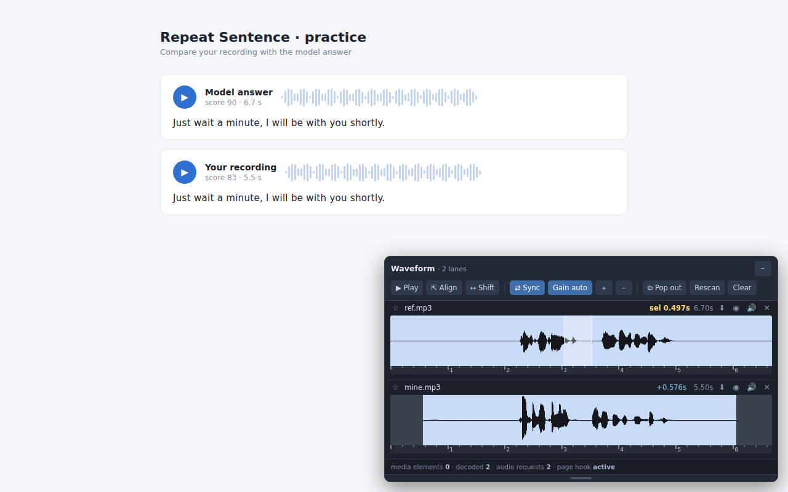

# Waveform Viewer

A browser extension that draws a real waveform for any audio a web page plays, so
you can compare two recordings, align them, measure intervals to the millisecond,
and download what you selected.



## Why

Comparing two recordings normally means downloading both files, opening a desktop
audio editor, lining them up by hand, and reading timings off a ruler. This does
all of that in the page, in a panel you can pop onto a second monitor.

## Features

- **Waveform per clip**, stacked as lanes in a floating panel
- **One shared time scale** so lanes line up vertically and pacing differences show
- **Align** crops the dead air off both ends and starts every clip together, in one
  click — or drag a lane sideways by hand with a millisecond readout
- **Synced playback** of every lane through a single playhead; mute or solo lanes
- **Drag to measure** any interval to three decimal places
- **Download** the selected region as WAV, or the original file untouched
- **Open local files** — compare a recording from your disk against one from the page
- **Its own window** you can drag to another monitor, independent of the tab
- Finds audio through four routes, including Web Audio players that never create an
  `<audio>` element

Nothing is uploaded anywhere. No accounts, no analytics, no remote code.

## Install

**From the stores** — Chrome Web Store / Firefox Add-ons (links once published).

**From source**

```bash
git clone https://github.com/EricZhou866/waveform-viewer.git && cd waveform-viewer
./build.sh          # writes dist/waveform-viewer-{chrome,firefox}-<ver>.zip
```

- *Chrome*: `chrome://extensions` → Developer mode → **Load unpacked** → `build/chrome`
- *Firefox*: `about:debugging#/runtime/this-firefox` → **Load Temporary Add-on** →
  `build/firefox/manifest.json` (temporary add-ons are removed when Firefox restarts)

## Usage

The panel appears in the bottom-right as soon as audio is detected.

### Toolbar

The toolbar is icons only; hover any of them for what it does.

| Button | What it does |
|---|---|
| `▶` | Play every un-muted lane together on one playhead. Stops and rewinds to the start when the longest lane finishes. `Ctrl/⌘ + Space` |
| `⊕` | Open audio files from your computer (or just drag them onto the panel) |
| `⊗` | Remove all lanes |
| `⇤` | **On by default** — audio arrives already cropped to its sound and starting at zero. Click to restore the full clips; audio that arrives while it is off stays whole |
| `↔` | *(hidden by default)* Drag a lane sideways to align by hand (hold **Shift** to toggle temporarily). The ruler stays put; the waveform slides |
| `＋` / `－` | *(hidden by default)* Lane height. Drag any edge or corner of the panel to resize the panel itself — that sets how many lanes are on screen before the list scrolls |
| `⧉` | Open the panel as its own browser window — drag it to a second monitor. The in-page panel steps aside while it is open |
| `⇲` | *(in the standalone window)* Close it and put the panel back into the page |
| `⟳` | *(hidden by default)* Scan the page again and ask it to re-announce the audio it has already loaded — use this if you closed a lane and the site replays without a fresh request |
| `⚙` | Settings |

Play, open and clear sit together at the front. The four marked *hidden by default*
appear once you turn on **Show extra buttons** in Settings.

On the title bar: `－` minimises the panel to a small bar that takes almost no
space, and `✕` closes it on that page — clicking the extension's toolbar button
brings it back.

### Per lane

| Control | What it does |
|---|---|
| `☆` | Pin — never auto-evicted when new audio appears |
| `+0.576s` | Current time offset; click to reset to zero |
| `⬇` | Download: the selection as WAV, or the whole original file |
| `◉` | Solo — mute every other lane |
| `♫` | Mute this lane (struck through while muted) |
| `✕` | Remove this lane |

### Settings (`⚙`)

| Setting | Default | What it does |
|---|---|---|
| Max lanes | 0 — no limit | Every clip gets a lane and the list scrolls. Set a number (1–64) if you would rather cap it; past the cap, new audio waits in a queue instead of being thrown away |
| Ignore clips shorter than | 2 s | Anything shorter never gets a lane (0.5–10 s). Players fire silent primers before playback, and sites throw in UI blips and ad stingers; without a floor those crowd out what you are actually comparing. Lower it if you are working with very short clips — lanes already on screen are re-checked as soon as you change it |
| Align on arrival | on | New audio comes in cropped to its sound and starting at zero, with no click. Turn it off to see clips at full length |
| Show extra buttons | off | Adds `↔`, `＋`, `－` and `⟳` to the toolbar |
| When full | Keep what is shown | Only applies once you set a limit. New audio is **parked, never discarded** — it slots in as soon as you close a lane or raise the limit. Switch to "Replace the oldest" for the old behaviour |
| Shared time scale | on | Lanes use one ruler so they line up vertically |
| Vertical zoom | Auto | Same factor for every lane, so loudness stays comparable |
| Align crops silence | on | Turn off to make Align line up onsets by offset instead |
| Crop strength | Normal | How loud counts as "not silence" (Gentle / Normal / Aggressive). Cropping works on a smoothed envelope and needs the sound to hold for a moment, so a stray click in the tail does not keep two seconds of near-silence alive |

Settings persist across sessions.

### On the waveform

| Action | Result |
|---|---|
| Click | Move the playhead there (restarts playback from that point if playing) |
| Drag | Select a region — the header shows its exact length |
| Drag with `↔ Shift` on, or holding Shift | Move that lane in time |
| Double-click | Clear the selection |

## The panel window

`⧉ Window` opens the panel as a real browser window. Drag it to a second monitor
and maximise it — the waveforms fill the screen and the lane height splits the
available space.

The window is a normal extension window, not a popup owned by the tab, so it
survives navigating away and can be left open across practice sessions. Only one
panel is ever visible: the in-page panel hides while the window is open and comes
back when you close it — or when you press `⇲ Dock` inside the window, which does
the same thing without hunting for the close button. Lanes the tab finds afterwards
are pushed across automatically, and you can open more files directly in the window
with `⊕ Files` or by dropping them in. Note that the hand-over is one-way: files you
opened *in the window* do not travel back to the page when you dock.

More lanes than fit on screen scroll inside the panel rather than disappearing below
its bottom edge, in both the in-page panel and the window. Nothing is held back out of
sight: every clip that passes the minimum length gets a lane.

Audio the page holds as a `blob:` URL cannot be fetched from an extension page, so
those clips travel to the window as bytes instead — you get the waveform either way.
If the original file bytes cannot be read (Firefox blocks reading a buffer that
came from another context), the audio is re-encoded from what was already decoded,
so the hand-over still works. The window opens first and the audio follows, so a
problem with one clip never leaves you without a window.

## Comparing two recordings

1. Play the reference clip — lane 1 appears. Pin it with `☆`.
   (Or use `⊕ Files` / drag-and-drop if you already have the file on disk.)
2. Play your own recording — lane 2 appears.
3. Both clips are already cropped and started together — that is what `⇱ Align`
   does, and it is on by default, so the speech itself is what you are comparing.
   A `✂` next to the duration marks a cropped lane, and the download button then
   saves exactly what is on screen. Click `⇱ Align` if you want the full clips back.
4. `▶ Play` to hear them layered; `🔇` one lane to hear just the other.
5. Drag across any pause to read its exact length.
6. `⬇` to save a region as WAV.

## Troubleshooting

The status line at the bottom of the panel reports what was detected:

```
media elements 2 · decoded 1 · audio requests 3 · page hook active
```

- **No panel at all** — the extension is not running. Reload the extension, then
  hard-reload the page.
- **page hook blocked** — the page's CSP blocked the injected hook, so only
  `<audio>`/`<video>` elements can be found; Web Audio players will be missed.
- **All counters zero** — play some audio first. Still zero means the page uses a
  path this extension does not cover.
- **A lane you closed does not come back on replay** — hit `Rescan`. Some players
  replay from memory without touching the network, so there is nothing for the
  detector to see.
- **A clip you wanted never shows up** — it may be shorter than the minimum length
  (Settings ▸ *Ignore clips shorter than*, 2 s by default). Lower it and play the
  audio again. The floor exists because many players fire a silent `data:` primer
  before every playback to unlock the audio context, and those would otherwise pile
  up as empty lanes. A source that turns out not to be usable audio is remembered
  and not fetched again.
- **A lane shows ⚠** — the audio bytes could not be read; the message says why.
  Media Source Extensions (adaptive streams) and DRM-protected audio cannot be read.

## Limits

- MSE / DRM-protected streams cannot be decoded
- Files over 60 MB are skipped
- No limit on lanes by default — they scroll. A hard ceiling of 64 keeps a long
  session from growing without bound, since every lane holds a decoded buffer
- Repeats of the same clip are merged automatically: many sites mint a new
  `blob:` URL on every play, so lanes are de-duplicated by an audio fingerprint
  rather than by URL
- Firefox 140+ / Chrome 109+

## Layout

```
src/              shared source for both browsers
  content.js      panel UI, rendering, transport, download — runs both as the
                  content script and as the standalone panel window
  panel.html      the standalone window
  page-hook.js    page-world hook, reports back via postMessage
  background.js   toolbar toggle + cross-origin audio proxy
manifests/
  chrome.json       MV3, service worker
  firefox.json      MV2  (default for Firefox)
  firefox-mv3.json  MV3 alternative
build.sh          copies src/ + the right manifest into build/, zips into dist/
store/            listing copy, privacy policy, reviewer notes, screenshots
test/             manual test pages, plus e2e.js — the regression run against
                  the built extension (node test/e2e.js, see DESIGN.md §20)
```

## Design

[DESIGN.md](DESIGN.md) documents the architecture, the algorithms, and an archive of
the bugs that shaped them. Read it before changing anything here.

## License

MIT — see [LICENSE](LICENSE).
